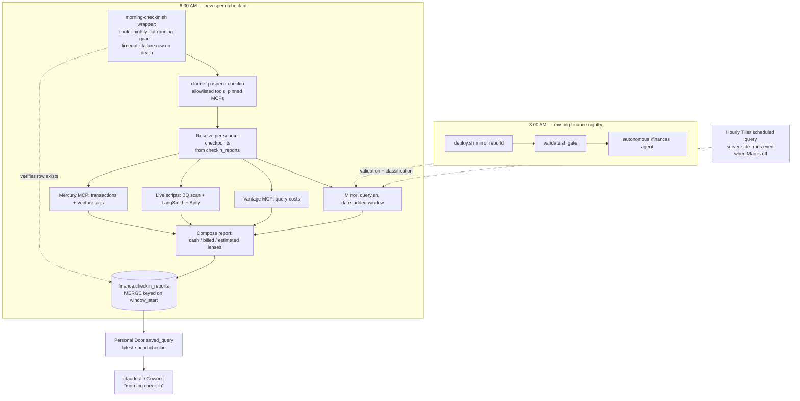

# Daily Spend Check-In - Plan

**Target repo:** `stevenharrisonjacobs-phl/personal` (canonical checkout: `~/conductor/repos/personal`). All file paths below are relative to that repo unless marked otherwise.

---

## Goal Capsule

- **Objective:** Every morning Steve can ask Claude (on claude.ai or in Claude Code) "what have I spent since my last check-in?" and get one correct, complete answer covering personal transactions, Snapfix cloud/AI costs, and Plum Growth Mercury spend — his full financial picture — fresh as of 6:00 AM Eastern that day.
- **Means:** A scheduled 6am launchd job runs a headless Claude session that invokes a new `/spend-checkin` skill; the skill gathers the four cost sources, writes the report to BigQuery, and the Personal Door serves it via a saved query (KTD1, KTD2).
- **Authority hierarchy:** This plan > the personal repo's existing conventions (`AGENTS.md`, the shared `personal` skill's write discipline) > implementer judgment. The door's read-only rule and the never-commit-row-level-data rule are inviolable.
- **Stop conditions:** Stop and surface to Steve if: the Mercury MCP cannot be authorized, or its OAuth tokens prove unusable under launchd (U2's proof); the door deploy would require a connector remove/re-add; or restoring the canonical repo (U1) reveals the nightly mirror has been broken long enough that transaction data is materially stale.

---

## Product Contract

### Summary

Build a recurring daily spend check-in: a 6:00 AM Eastern job that assembles "money spent since my last check-in" from (1) the personal finance mirror (`/finances` — transactions with categories), (2) Snapfix costs from the Vantage MCP plus same-day nightly-run costs not yet ingested by Vantage, and (3) Plum Growth's Mercury bank spend (Snapfix + Bobsled) via the official Mercury MCP. The finished report lands in BigQuery behind the Personal Door, so any Claude surface connected to the door can deliver it.

### Problem Frame

Steve's spending is split across three systems that never meet: personal transactions in the Tiller→BigQuery mirror, Snapfix cloud/AI costs spread across Vantage and live APIs (with Vantage lagging a day or more), and Plum Growth's business spend in Mercury. Answering "how much did I spend?" today means running three separate rituals (`/finances`, `/snapfix-costs`, and checking Mercury by hand). There is no single morning answer, and no tracked notion of "since I last looked."

### Requirements

**Report content**

- R1. The report covers spend since the last successful check-in, and states its window (start/end timestamps) explicitly. Per-source coverage windows may differ per R12; the report shows each source's window when they diverge.
- R2. Personal — transactions: a list of the window's transactions (date + merchant + amount + canonical category), transfers excluded, uncategorized spend flagged, with category totals beneath. The mirror pull windows on arrival (`date_added`), not `transaction_date`, so late-arriving bank-feed rows land in exactly one report (KTD8 owns the mechanism; `date_added` is day-granular, so the boundary day is labeled, never silently dropped).
- R3. Work — consumption with trends: the window's Snapfix consumption broken out as four lines — BigQuery, AI API credits (Anthropic + OpenAI), Apify, and LangSmith-tracked run costs — each carrying a week-over-week marker (this window vs. the same window seven days earlier: more, less, or flat, with the delta). Billed (Vantage) vs. live-estimate labeling per KTD4 applies within the lines, never as a separate section.
- R4. Other subscriptions — Mercury: Plum Growth spend since that source's checkpoint, listed per counterparty with venture tag (`snapfix`, `bobsled`, `unmapped`), amount, and transaction count; unmapped counterparties listed for review. Content stays within R14's contract.
- R15. Personal — watch items: expected recurring charges that have not hit their usual window (mortgage, insurance, subscriptions), derived from vendor cadence history in the mirror plus a curated expectations file, each rendered as "expected around <date>, not yet seen". This is the guard against the known failure mode — three mortgage payments once went unnoticed for a quarter.
- R5. Headline summary: personal cash spend and business spend as separate figures, with cash actuals (Mercury, mirror) never silently summed with accrued usage estimates (Vantage, live APIs) — KTD4 owns the framing.
- R6. A source that fails or returns nothing is reported as unavailable in a Notes section, never silently omitted (same discipline as `/snapfix-costs` and the door's relay-refusals rule).
- R7. The report includes a feed-freshness caveat when the mirror's bank feeds look stale (the `feed_health` / `source-freshness` check), so a dead feed cannot fake a low-spend morning.

**Schedule and delivery**

- R8. Generation runs automatically every day at 6:00 AM America/New_York. A Mac asleep at 6:00 runs the job on wake; a Mac powered off at 6:00 runs it at next login (`RunAtLoad` plus the KTD8 idempotency guard, so a same-day duplicate becomes a no-op).
- R9. The finished report is readable from claude.ai through the Personal Door without any connector remove/re-add per release (KTD1).
- R10. No row-level financial data is ever committed to git (`.context/` and BigQuery only).
- R14. Report content contract: transaction-level lines are bounded to date + merchant + amount + category — no account identifiers beyond `*_masked` forms, no memo/description free text, no balances. When a window spans more than ~5 days, the personal list collapses to category totals with a count, so a long-gap report stays readable and bounded. The write path enforces an account-number-pattern check and a length cap on `report_md` (the door redacts by column name only; free text ships verbatim, so protection must happen at write time).

**Operations**

- R11. Every scheduled run produces exactly one recorded outcome. The wrapper script — not the agent — owns failure recording: on nonzero exit, timeout, or a missing report row after apparent success, the wrapper writes the `status='failed'` row deterministically. A hung or dead agent session can never leave an unrecorded run.
- R12. The generator degrades per-source: one failed source still produces a report with that section marked unavailable per R6. Coverage is never lost: each source's next window extends back to that source's own last successful pull (per-source windows in KTD8), so a source that failed Tuesday reports Tuesday + Wednesday spend on Wednesday.
- R13. No concurrent or mid-rebuild reads: the generator does not run while the finance nightly (`nightly-sync.sh`) is running, and asserts mirror recency (`gold.transactions.built_at` fresher than ~2h, courtesy of the hourly scheduled query) before the personal pull — deferring or caveating the report otherwise.

### Key Decisions

- **Report structure is Steve's four-part layout.** Personal transactions (as a list) → Personal watch items (recurrings not yet hit) → Work consumption with week-over-week trends (BigQuery / AI API credits / Apify / LangSmith) → Other subscriptions (Mercury). (session-settled: user-directed — chosen over the aggregate-grade three-lens layout: Steve specified the sections, the transaction list, the trend comparison, and the four consumption lines, 2026-09-08.) Governs R2, R3, R4, R15.
- **Check-in = successful generation run.** The checkpoint advances when a generation run completes — scheduled or ad-hoc. An interactive midday `/spend-checkin` generation advances it (next morning's report covers the shorter window); the consumption branch is read-only and never advances it. Governs R1, R11, R12.
- **Delivery is pull-through-door.** claude.ai has no push channel and the door is read-only by design, so "delivered through the Personal Door" means the report is queryable behind the door the moment it lands. Governs R9.

### Success Criteria

- On a normal morning, asking Claude in Cowork "morning spend check-in" returns that day's report — window, three sections, headline — sourced from one `saved_query` call.
- A deliberately broken source (e.g. Mercury token revoked) still yields a morning report with that section flagged, the run advances that day, and the next successful pull covers the gap (R12).

### Scope Boundaries

- No push delivery (email, Slack, notifications) — pull through the door only.
- No budget alerts or thresholds.
- No new door *tools* — the existing `saved_query` toolset serves the report (avoids the connector re-add gotcha).
- No historical backfill of check-ins; history begins at first run.
- No changes to the 3am finance nightly beyond restoring it to working order (U1); the overlap guard (R13) lives entirely in the new job's wrapper.
- Business accounts outside Mercury (if any) are out of this picture.
- Generation from Cowork is out by design — the door is read-only; Cowork gets consumption-only parity.

#### Deferred to Follow-Up Work

- Budget/threshold alerting on top of `checkin_reports`.
- A weekly rollup that doubles as reconciliation: it re-scans the week with hindsight and catches anything the daily windows missed (late arrivals beyond R2's handling, gaps from repeated source failures).
- Surfacing the check-in agent's own run cost inside the report (it is logged per U5, just not rendered).
- Serving the report to the snapfix-door or Bobsled door audiences.

### Outstanding Questions

All deferred (non-blocking); none block implementation:

- Where the Claude CLI stores hosted-MCP OAuth tokens (Keychain vs `~/.claude`) — determines exactly which env pinning Mercury needs under launchd. U2's launchd-context proof answers it empirically either way.
- Whether a strict `--allowed-tools` allowlist coexists with MCP OAuth token refresh in `claude -p` — unproven in this estate (the nightly only proved `bypassPermissions` and a Bash-only allowlist). U2 proves it before U5 depends on it.
- Whether Vantage costs need a Snapfix-only filter later — today the workspace's three providers are all Snapfix-related, so no filter is needed.

---

## Planning Contract

### Key Technical Decisions

- KTD1. **Deliver via a saved query, not a new door tool.** Drop `queries/latest-spend-checkin.sql` into the repo's `queries/` directory — the door auto-catalogs `queries/*.sql` (`door/saved_queries.py`), so a redeploy publishes it with zero toolset change. A connector's tool list snapshots at add-time (documented gotcha in `docs/personal-door-spec.md`), so a new tool would force a remove/re-add; a saved query does not. A door redeploy still expires live MCP sessions — release notes say so. Governs R9.
- KTD2. **Runner = launchd + headless `claude -p` on the canonical repo.** Mirrors `scripts/com.stevenjacobs.finance-nightly.plist` + `scripts/nightly-sync.sh`: pinned PATH, USER/LOGNAME for Keychain, `NIGHTLY_SA_KEY` activated into a throwaway `CLOUDSDK_CONFIG`. An agent session (not a plain script) is required because two sources are MCPs (Vantage, Mercury). The Mac's timezone is America/New_York, so `StartCalendarInterval` Hour 6 is 6am ET; `RunAtLoad` true + the KTD8 idempotency guard covers the powered-off case (R8).
- KTD3. **Mercury via the official hosted MCP** (`https://mcp.mercury.com/mcp`, OAuth, read-only accounts/transactions), added at user scope so both interactive and headless sessions see it. Fallback if headless OAuth refresh proves unreliable: Mercury's REST API with a key in the canonical repo's `.env`. (User-named resource: "mercury spend via the MCP".)
- KTD4. **Cash vs. accrual are separate lenses, never summed.** Mercury transactions are cash actuals — and they *include* the eventual bills for Anthropic/GCP/OpenAI/Apify usage that Vantage and the live scripts measure at usage level. Summing Mercury + Vantage double-counts. The report presents: mirror + Mercury = cash out; Vantage = billed usage for the window; live scripts = same-day usage estimate not yet in either. Governs R3, R5.
- KTD5. **`checkin_reports` lives in the `finance` dataset as a durable operational table.** `deploy.sh`'s destructive surface is table-scoped (`CREATE OR REPLACE` on `finance.transactions`, `finance.balance_history`, `gold.transactions`, plus views); durable state already lives inside rebuild datasets via `CREATE TABLE IF NOT EXISTS` (`finance.manual_income`, `finance.classification_rules`, `gold.vendor_rules`, …). Follow that exact pattern: `CREATE TABLE IF NOT EXISTS` in `sql/checkin.sql`, applied by `deploy.sh` so the table self-heals on a fresh project. This needs zero door changes — the door's validator allowlists only the `finance`/`gold` datasets, so any new dataset would cost five touch points (validator tuple, `SOURCES`, `_SUBSTITUTIONS`, `lib.sh render_sql`, `deploy-door.sh` env). Amend the `AGENTS.md` sentence claiming `finance.*`/`gold.*` are "derived and safe to rebuild" to carve out operational tables.
- KTD6. **Snapfix live costs reuse the `/snapfix-costs` methodology** (global skill at `~/.claude/skills/snapfix-costs/SKILL.md`): BigQuery `INFORMATION_SCHEMA.JOBS_BY_PROJECT` at $6.25/TB on project `snapfix-agents`, LangSmith root-run `total_cost` over projects `Snapfix` + `Snapfix-Agents`, Apify `actor-runs` `usageTotalUsd` — each scoped to the source's window. Secrets are sourced from `~/code/snapfix/.env.local` (a cross-repo coupling); when that file is missing or a key is absent, the script fails loudly by name and the report's Notes say exactly which env is missing — never a bare "unavailable". Localizing copies of the three keys into the personal `.env` is the recorded fallback if snapfix worktree churn breaks the path.
- KTD7. **Headless invocation contract — least privilege, wrapper-owned lifecycle.** The 6am session runs with an explicit `--allowed-tools` allowlist, never `bypassPermissions`: Read/Grep/Glob, `Bash` scoped to `./scripts/query.sh`, `./scripts/spend-checkin-costs.sh`, and the deterministic insert script, the Mercury MCP tools, and only the read-side Vantage tools — the Vantage MCP ships destructive writes (`delete-cost-report`, `delete-workspace`, …) that an unattended session must not hold. The prompt arrives via stdin (the nightly's variadic `--allowed-tools` lesson) and selects the generation branch by argument, never by `AskUserQuestion` (a headless session deadlocks on questions). MCP surface is pinned to exactly `vantage` + `mercury` via `--mcp-config`/`--strict-mcp-config`. The wrapper enforces a wall-clock `timeout` (~25 min), treats the report row as the completion signal (after exit 0 it verifies a fresh row exists, else records failure), and captures `--output-format json` so the run's own token cost and duration land in the log. This run is the repo's second authorized unattended writer (after the nightly, "Steven's call 2026-08-17"); its write surface is exactly `finance.checkin_reports`, recorded here as the mandate.
- KTD8. **Idempotent, append-only state with per-source windows.** One row per run, written atomically by a deterministic parameterized script (agent-composed inline SQL is itself an integrity failure path) via `MERGE` keyed on the consumed checkpoint / `window_start` — a double fire (calendar + wake, or manual + scheduled) becomes a no-op, never a second successful window. The row stores the consumed checkpoint; the `sources` JSON stores per-source `window_start`/`window_end`/`status`, and each source's next window resolves from that source's last success (R12). Failed rows never advance any checkpoint. The table is append-only with no expiration; recovery from a bad write is BigQuery time travel, not UPDATE. Invariants: successful windows are contiguous and non-overlapping; at most one successful row per `window_start`; `window_end > window_start`, `run_ts >= window_end`, all UTC. Governs R1, R2, R8, R11, R12.

### Assumptions

Un-validated bets made without a synchronous user; correct at review if wrong:

- "Since my last check-in" means since the previous successful generation run, not since Steve last read a report.
- Delivery is pull: Steve asks Claude and the door serves the latest report. No push channel is wanted.
- 6:00 AM on this Mac is the schedule; a sleeping Mac running the job on wake (report arrives late) is acceptable, matching the existing 3am job's behavior.
- Mercury→venture tagging by a counterparty mapping file in the repo is sufficient; unmapped counterparties listed for review beats guessing.
- These three sources are the "full financial picture"; nothing else needs ingesting.
- The Vantage workspace (`Default`, created 2026-09-01) is Snapfix's cost home; its history starting in September is acceptable since check-in windows are ~1 day.
- The "LangSmith" consumption line means the LLM run costs LangSmith tracks (the live estimate of API usage), not LangSmith's own platform subscription — that lands under Other subscriptions when it bills through Mercury. The AI-API-credits line is the billed counterpart (Vantage); the two overlap by design and KTD4's labeling keeps them from being summed.
- Watch-item cadence detection can be derived from the mirror's vendor history (`gold.vendors` activity dates and monthly patterns) with a small curated expectations file for the ones that matter most; a missed detection surfaces at worst in the weekly reconciliation rollup.

### High-Level Technical Design

Mirror *freshness* comes from the hourly server-side scheduled query; the 3am nightly adds validation and classification. The wrapper's guards (R13) prevent reading a mid-rebuild mirror when a wake fires both jobs at once. Every source failure routes to the report's Notes (R6, R12) rather than aborting the compose step.

### Sources & Research

- Door architecture and gotchas: `docs/personal-door-spec.md`; live check 2026-09-08 confirmed the door deployed, authorized, serving 17 saved queries.
- Saved-query auto-catalog: `door/saved_queries.py`; source whitelist + dataset-level validator + column-name redaction: `door/finance_native.py` (project `steven-tiller-finance-2026`, datasets `finance` + `gold`).
- Rebuild surface: `scripts/deploy.sh` + `sql/refresh.sql` (`CREATE OR REPLACE` targets; `date_added` survives at line ~52), `sql/gold.sql` (exposes `date_added`; durable-table precedent).
- Launchd/headless lessons (PATH, Keychain USER/LOGNAME, SA key, stdin prompt, verify with `launchctl start` not a shell run): `scripts/nightly-sync.sh`, `scripts/com.stevenjacobs.finance-nightly.plist`, `docs/archive/2026-08-18-finance-classification-and-nightly.md`.
- Vantage live check: single workspace `wrkspc_11e5a634c05d1ca2`, providers Anthropic / GCP / OpenAI, one "All Resources" report. Vantage MCP is user-scope HTTP (`https://mcp.vantage.sh/mcp`) and includes destructive write tools — hence KTD7's read-only allowlist.
- Mercury MCP: [docs.mercury.com/docs/what-is-mercury-mcp](https://docs.mercury.com/docs/what-is-mercury-mcp), [connecting guide](https://docs.mercury.com/docs/connecting-mercury-mcp) — hosted at `https://mcp.mercury.com/mcp`, OAuth, read-only.
- Query conventions (sign, transfers, `spend_amount`): `queries/monthly-spending.sql`, `.claude/skills/finances/context/definitions.md`.
- Plugin sync mechanics (curated `SKILLS` array, transport-marker lint, `cp -RL` of whole skill dirs): `scripts/sync-cowork-plugin.sh`.
- Snapfix live-cost recipes: `~/.claude/skills/snapfix-costs/SKILL.md` (outside this repo).

---

## Implementation Units

### U1. Restore the canonical repo and the finance nightly

- **Goal:** The canonical checkout and the 3am nightly job work again, so the 6am job has a home and validated mirror data. (Tracked as repo issue #27.)
- **Requirements:** Precondition for R2, R7, R8.
- **Dependencies:** none.
- **Files:** no repo file changes expected — operational: fast-forward `~/conductor/repos/personal` to `origin/main`, reinstall `scripts/com.stevenjacobs.finance-nightly.plist` into `~/Library/LaunchAgents/`, verify `.env` still carries `NIGHTLY_SA_KEY`.
- **Approach:**
  1. Fast-forward the canonical checkout (working tree currently sits at the initial commit with no tracked files; gitignored `.env` survived).
  2. Confirm the Tiller sheet is still shared with the service account; run `scripts/validate.sh`.
  3. Reinstall and kick the nightly: verify via `launchctl start com.stevenjacobs.finance-nightly` per the archive doc's lesson — never trust an interactive shell run.
  4. Check `queries/source-freshness.sql` output for feed staleness accumulated while the job was down.
- **Test scenarios:**
  - `scripts/validate.sh` passes against the restored checkout.
  - A `launchctl start`-triggered run writes a dated report under `.context/nightly/`.
- **Verification:** Next calendar-triggered 3am run completes; mirror row counts move.

### U2. Wire the Mercury MCP, prove the headless contract, and seed the venture mapping

- **Goal:** Headless launchd sessions can read Mercury and Vantage through a pinned, allowlisted MCP surface, and counterparties resolve to `snapfix` / `bobsled` / `unmapped`.
- **Requirements:** R4, R12 (KTD3, KTD7).
- **Dependencies:** none.
- **Files:** `.claude/skills/spend-checkin/context/mercury-mapping.md` (new — counterparty → venture table, no amounts); user-scope MCP config (outside repo).
- **Approach:**
  1. Add the server at user scope: `mercury` → `https://mcp.mercury.com/mcp` (HTTP transport).
  2. Complete OAuth once in an interactive session with Steve present (non-interactive sessions cannot run the flow).
  3. Prove the KTD7 contract *before* U5 depends on it: a throwaway launchd job (or `launchctl start` of a test plist) runs `claude -p` with the strict MCP pin and tool allowlist, and pulls one Mercury page and one Vantage `query-costs` call. This is the launchd-context proof — a friendly shell hides exactly what breaks (Keychain, env, OAuth refresh).
  4. Seed the mapping file from the last ~90 days of Mercury counterparties; anything unrecognized starts as `unmapped`.
- **Test scenarios:**
  - Listing accounts through the MCP returns the Plum Growth account(s).
  - A transaction pull for a known date range returns rows matching the Mercury dashboard.
  - A counterparty absent from the mapping tags as `unmapped`, not guessed.
  - Under launchd with the strict allowlist: Mercury and Vantage reads succeed; a Vantage *write* tool call is unavailable or denied.
- **Verification:** The launchd-context proof passes end-to-end; its transcript shows only allowlisted tools were available.

### U3. Check-in state and report storage in BigQuery

- **Goal:** A durable `finance.checkin_reports` table holds one row per run with the KTD8 invariants enforced by shape, not convention.
- **Requirements:** R1, R10, R11, R14 (KTD5, KTD8).
- **Dependencies:** U1.
- **Files:** `sql/checkin.sql` (new DDL, `CREATE TABLE IF NOT EXISTS`); `scripts/deploy.sh` (append a render-and-apply step for `sql/checkin.sql` after `reviewer.sql`, following the existing per-file pattern — deploy.sh applies a hardcoded file sequence, not a glob, so a new SQL file never runs without this edit); `scripts/checkin-write.sh` (new — the deterministic parameterized MERGE writer taking composed JSON + markdown from `.context/`); `scripts/validate.sh` (extend `required_tables`); `AGENTS.md` (carve operational tables out of the "safe to rebuild" claim).
- **Approach:**
  1. Schema (directional): `run_ts`, `consumed_checkpoint`, `window_start`, `window_end`, `status`, `sources` (JSON: per-source window/status/totals), `totals` (JSON: headline numbers), `report_md` (STRING, length-capped).
  2. Writer: single atomic `MERGE` keyed on `window_start` (KTD8); re-resolves the checkpoint immediately before writing and aborts loudly if it moved; applies the R14 account-number-pattern and length checks before the write; no UPDATE path exists.
  3. Checkpoint resolution: global = `MAX(window_end)` over `status='success'`; per-source from the `sources` JSON of successful pulls; first run defaults to the prior 24h.
- **Test scenarios:**
  - With zero rows, checkpoint resolution yields the 24h default.
  - After a successful row, the next global and per-source checkpoints match that row.
  - A failed run's row advances nothing (I3).
  - Two writers with the same consumed checkpoint → one successful row (MERGE no-op or `skipped_duplicate`).
  - A `report_md` containing an account-number-like string or exceeding the cap is rejected before write.
  - Running `deploy.sh` afterward leaves `checkin_reports` intact and re-applies `sql/checkin.sql` harmlessly.
- **Verification:** The KTD8 invariant queries (contiguity, no overlap, uniqueness, sanity — Verification Contract) return clean over several manual runs.

### U4. The `/spend-checkin` generator skill

- **Goal:** One skill that gathers all four sources for their windows, composes the report in the four-part layout (Key Decisions) within R14's content contract, and hands the row to the deterministic writer.
- **Requirements:** R1–R7, R12, R14, R15 (KTD4, KTD6, KTD8).
- **Dependencies:** U2, U3.
- **Files:** `.claude/skills/spend-checkin/SKILL.md` (new); `.claude/skills/spend-checkin/references/generate.md` (the generation procedure, marked Claude-Code-only in `sync-cowork-plugin.sh` lint-satisfying language); `.claude/skills/spend-checkin/context/expected-recurrings.md` (new — curated recurring-charge expectations: vendor, cadence, usual day; no amounts); `queries/recurring-watchlist.sql` (new — vendors with monthly cadence whose expected window has passed with no transaction, from `gold.vendors` + `gold.transactions`); `scripts/spend-checkin-costs.sh` (new — the deterministic LangSmith/Apify/BQ-scan pulls adapted from the `/snapfix-costs` recipes, also fetching the same-window-last-week comparison, emitting JSON to `.context/`).
- **Approach:**
  1. Resolve per-source checkpoints (U3); run the freshness check (`queries/source-freshness.sql`) for the R7 caveat.
  2. Mirror pull via `./scripts/query.sh`, windowed on `date_added` per R2 — SQL returns the bounded transaction list (date + merchant + amount + category) plus category totals, collapsing to totals-only past R14's ~5-day threshold so a long window cannot exhaust context.
  3. Watch-items pull: `queries/recurring-watchlist.sql` merged with `context/expected-recurrings.md` — recurrings past their expected window render per R15.
  4. Vantage pull via the MCP `query-costs` grouped by provider, for the window AND the same window seven days earlier (the R3 trend baseline).
  5. Live costs via `scripts/spend-checkin-costs.sh` (KTD6), which also emits the last-week comparison window; on missing env it names the missing key for the Notes section.
  6. Mercury pull via the MCP, aggregated per counterparty; tag through `context/mercury-mapping.md`.
  7. Compose the report in the four-part layout (window header → headline per R5 → Personal transactions → Watch items → Work consumption with week-over-week deltas → Other subscriptions → Notes per R6, including the standing late-arrival line) and invoke `scripts/checkin-write.sh`.
  8. Any source failure: mark it failed with its window in `sources`, keep composing (R12). A missing trend baseline (first week, or a failed comparison pull) renders as "no comparison available", never a fabricated delta.
  9. Branch selection is by invocation argument (generate vs. consume) — never an interactive question, so the headless path cannot deadlock (KTD7).
- **Patterns to follow:** report shape and per-source Notes discipline from `/snapfix-costs`; transport and reporting rules from the shared `personal` skill; sign conventions from `context/definitions.md` (spend positive, transfers excluded); the one-skill-multi-branch router shape from `/finances`.
- **Test scenarios:**
  - Happy path: all four sources return data → report has all sections, totals reconcile with source pulls, row written, checkpoints advance.
  - Mercury token revoked → Mercury section "unavailable", run succeeds; the *next* run's Mercury window covers both days (R12).
  - Vantage returns zero rows for the window (ingestion lag) → billed lens shows $0 with a lag note, live lens still populated.
  - A window spanning 3 days (Mac was off) → all sources scoped to their full windows, header states it, context survives via aggregates-first pulls.
  - Uncategorized personal transactions present → flagged per R2 within R14's line format.
  - A transaction dated last week arriving in the mirror today → appears in today's report (date_added windowing), not silently dropped.
  - A recurring vendor (e.g. mortgage) past its expected day with no transaction → renders as a watch item per R15; the same vendor having hit → no watch item.
  - Week-over-week deltas match hand-computed values from the two windows; a first-run report with no baseline says "no comparison available" rather than inventing one.
  - A 6-day window → personal section collapses to category totals with a transaction count (R14's threshold).
  - No same-day snapfix activity → the consumption lines say so in one line.
- **Verification:** A manual invocation produces a row whose `report_md` renders correctly, passes the R14 checks, and whose totals match hand-checked source queries.

### U5. The 6am runner

- **Goal:** launchd triggers the generator every morning at 6:00 ET under the KTD7 contract, with the wrapper owning locking, timeout, and failure recording.
- **Requirements:** R8, R11, R13 (KTD2, KTD7).
- **Dependencies:** U4.
- **Files:** `scripts/morning-checkin.sh` (new); `scripts/com.stevenjacobs.spend-checkin.plist` (new).
- **Approach:**
  1. Mirror `nightly-sync.sh`'s env block: pinned PATH, USER/LOGNAME, `NIGHTLY_SA_KEY` into throwaway `CLOUDSDK_CONFIG`.
  2. Guards before launching the agent: `flock` self-lock (no concurrent generators); skip-and-defer while `nightly-sync.sh` is running (pgrep — keeps the nightly untouched per Scope Boundaries); today-guard (successful row already exists → exit 0, satisfying R8's `RunAtLoad` path).
  3. Launch `claude -p` per KTD7: stdin prompt selecting the generation branch, strict MCP pin, tool allowlist, `timeout` ~25 min, `--output-format json` captured to `.context/checkin/` (run cost + duration audit).
  4. After exit: verify the expected row exists (completion signal = artifact); on nonzero exit, timeout, or missing row, write the `status='failed'` row via `scripts/checkin-write.sh` (R11).
  5. Plist: `StartCalendarInterval` Hour 6 Minute 0; `RunAtLoad` true (the today-guard makes it a no-op on ordinary logins).
- **Execution note:** Verify under launchd (`launchctl start com.stevenjacobs.spend-checkin`), never only in a shell — the archive doc records three failures only launchd surfaces.
- **Test scenarios:**
  - A `launchctl start` run completes end-to-end and writes the BQ row.
  - Hang simulation: agent killed/timed out mid-run → wrapper writes the failed row; next run's window self-heals (R11).
  - Double fire: trigger twice in succession → one effective run (today-guard/MERGE), no duplicate successful window.
  - Nightly running at trigger time → generator defers; log says why (R13).
  - With `claude` logged out → loud failure row + log, not silence.
- **Verification:** The first real 6:00 AM calendar trigger produces that morning's row unattended, and the JSON log shows the run's own cost.

### U6. Door delivery: whitelist + saved query + deploy

- **Goal:** The latest successful report is servable through the existing door toolset.
- **Requirements:** R9, R14 (KTD1, KTD5).
- **Dependencies:** U3.
- **Files:** `door/finance_native.py` (add `checkin_reports` to `SOURCES` — the `finance` dataset already passes the validator per KTD5); `queries/latest-spend-checkin.sql` (new); `tests/test_door_sql.py` (extend).
- **Approach:**
  1. Whitelist the table with grain/summary metadata matching existing `SOURCES` entries.
  2. Saved query returns the newest **successful** row: window, headline totals, `report_md` (a failed newest row is skipped in favor of the last success).
  3. Release via the full `deploy-door.sh` staging: build → candidate → probe → promote; no connector re-add needed since no tool changed (KTD1) — verify `list_saved_queries` shows the new entry through the live connector; note the redeploy drops live MCP sessions.
- **Test scenarios:**
  - The saved query passes `_validate_query` (whitelisted source, single SELECT, no DML).
  - The validator still refuses a query against a non-whitelisted table (regression guard).
  - Through the live door: `saved_query("latest-spend-checkin")` returns exactly one row — the newest successful one, even when the newest row is failed.
- **Verification:** `uv run --with pytest --with google-cloud-bigquery python -m pytest tests/ -q` green; `deploy-door.sh probe` healthy; live door call returns the report.

### U7. Consumer skill and Cowork plugin sync

- **Goal:** Saying "morning check-in" (or `/spend-checkin`) to Claude on any door-connected surface renders the latest report, with a staleness warning when it's old.
- **Requirements:** R9, plus the Success Criteria reading flow.
- **Dependencies:** U6.
- **Files:** `.claude/skills/spend-checkin/SKILL.md` (consumption branch — Cowork-facing content is consumption-only; generation stays isolated in `references/generate.md`); `.claude/skills/personal/SKILL.md` (add the saved query to the catalog table); `scripts/sync-cowork-plugin.sh` (add `spend-checkin` to the curated `SKILLS` array); `cowork/plugins/personal/` (synced mirror); `cowork/VERSION` + plugin manifest (version bump).
- **Approach:**
  1. Consumption branch: call `saved_query("latest-spend-checkin")`, render `report_md`, and warn when `run_ts` is older than ~26h.
  2. Keep every local-transport mention (`bq`, `query.sh`, snapfix env paths) in lint-satisfying Claude-Code-only language — the sync script lints synced `.md` files and fails otherwise, and it copies whole skill directories (`cp -RL`) with no per-file exclusion.
  3. Sync, check with `--check`, bump versions, push to `main` (claude.ai reads the default branch); Steve refreshes the plugin in the Cowork Plugins panel (documented sync-lag gotcha).
- **Test scenarios:**
  - In Cowork with door tools: the skill uses the door, never local scripts (never-mix rule).
  - Report older than 26h → the staleness warning renders with the report, not instead of it.
  - Door returns `{status, error}` → quoted verbatim, no retry (relay-refusals rule).
  - `sync-cowork-plugin.sh --check` passes with the new skill included (lint scenario).
- **Verification:** From a Cowork seat: "morning spend check-in" returns today's report in one tool call.

---

## Verification Contract

| Gate | Command | Proves |
|---|---|---|
| Repo scripts | `bash scripts/validate.sh` | shell syntax + BQ table existence (incl. `checkin_reports`) |
| Door tests | `uv run --with pytest --with google-cloud-bigquery python -m pytest tests/ -q` | validator + whitelist + new saved query (no GCP needed) |
| Plugin freshness | `./scripts/sync-cowork-plugin.sh --check` | Cowork plugin matches `.claude/skills/`, lint passes |
| Door health | `./scripts/deploy-door.sh probe` | deployed door answers (401 = healthy) |
| Runner (both jobs) | `launchctl start com.stevenjacobs.<job>` | the job runs under launchd's env, not a friendly shell |
| End-to-end | manual generator run, then `saved_query("latest-spend-checkin")` through the live door | the full pipeline, generation → BQ → door |

Standing acceptance criteria over `finance.checkin_reports` (KTD8's invariants, checkable as queries):

1. Zero pairs of successful rows with intersecting windows; successive successful windows are contiguous.
2. At most one `status='success'` row per `window_start` (and per ET calendar day).
3. No row with `window_end <= window_start` or `run_ts < window_end`.
4. The recorded `consumed_checkpoint` of the latest run equals `MAX(window_end)` over prior successful rows.
5. Every failed row (globally and per source) is eventually covered by a later successful window — no permanently unreported gap.
6. Zero mirror rows whose `date_added` falls inside a reported window but which appear in no report.
7. `LENGTH(report_md)` under the cap; `report_md` matches no account-number-like pattern.
8. Row count identical before/after a full `deploy.sh` run.

Quality gate for the report itself: totals in the rendered report must reconcile against a hand-run of each source for the same window before the skill is declared done.

---

## Definition of Done

- All seven units landed in the personal repo; door redeployed via the staged path; plugin synced, versioned, and pushed to `main`.
- One unattended 6:00 AM calendar-triggered run produced that morning's row under the KTD7 allowlist.
- The report was read from a Cowork seat through the door.
- A simulated source failure produced a degraded-but-delivered report, and the next run covered the gap (R12 proven end-to-end).
- The hang and double-fire scenarios (U5) were exercised, and the standing acceptance criteria return clean.
- No row-level financial data in git; `.context/` holds all raw pulls; `report_md` passes the R14 checks.
- The 3am finance nightly is confirmed running again (U1 was a real repair, not assumed — issue #27 closed).
- Dead-end and experimental code from the build is removed.

---

## Risks & Dependencies

- **The nightly mirror is currently down** (canonical working tree reset to the initial commit; no `com.stevenjacobs.*` launchd jobs installed as of 2026-09-08; tracked as issue #27). Mirror *freshness* survives via the hourly server-side scheduled query, but validation and classification are stopped. Highest-priority unit (U1).
- **3am/6am wake collision** — on a post-6am wake, launchd fires the missed nightly and the check-in near-simultaneously; without R13's guards the generator would read a mid-`CREATE OR REPLACE` mirror. Likeliest real-world failure in week one; U5's guards close it.
- **Unproven headless MCP posture** — a strict tool allowlist plus hosted-MCP OAuth refresh in `claude -p` has never run in this estate (the nightly proved only `bypassPermissions` and a Bash-only allowlist). U2 proves it before U5 depends on it; R12 degrades if a token dies later; REST-key fallback (KTD3) remains.
- **Vantage write tools in an unattended session** — the MCP exposes `delete-*`/`create-budget`-class tools; KTD7's read-only allowlist is the guard. Reviewers should treat any relaxation of that allowlist as a red flag.
- **Double counting** — Mercury cash includes cloud bills that Vantage/live also measure. KTD4's three-lens framing is the guard; the headline must never sum across lenses.
- **Late-arriving transactions** — bank feeds lag 1–2 days; `date_added` windowing (R2) plus the deferred weekly reconciliation rollup make late rows land exactly once instead of never.
- **Vantage ingestion lag and short history** (workspace created 2026-09-01): early reports lean on the live lens; the billed lens matures as history accrues.
- **Apify billing-cycle reset and BQ free tier** can make "billed" figures read lower than usage — carry the `/snapfix-costs` caveats into the report Notes.
- **Cross-repo secrets coupling** (KTD6) — `~/code/snapfix/.env.local` moving or a worktree change breaks the live lens; the named-key failure mode keeps it a loud, diagnosable Notes line instead of a silent "$0".
- **Connector tool-list snapshot** — any future door *tool* change still requires remove/re-add; this plan deliberately avoids one (KTD1).
